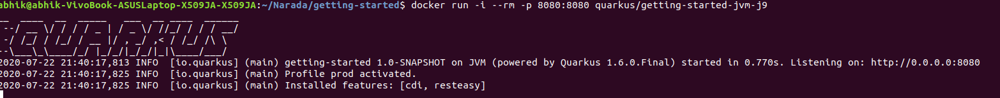

# Narada
### A Quarkus based web browser
Narada has been deployed loacally.
The images that have been built are given below:


The time taken for the application to start : 



Memory of the application : 71 MB

### To get started with it
(Advisable to clone in the HOME directory)
```
cd getting-started
./mvnw compile quarkus:dev
```
Incase, there are any issues with it then try out
```
./mvnw package
```
This also runs the test and builds the jar files for the version 0.01 (currently)
